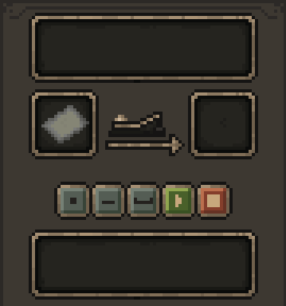

书信，信号，电话
=======
该模组的src文件夹下主要使用MIT协议，但不包括entity_model.  
entity_model和resources文件夹保持All Rights Reserved协议。   
你可以在以下链接查看相关协议的说明：[Mit](https://opensource.org/license/mit) 

游戏内容
============
本模组以玩家之间的通讯方式为主，目前包含“书信”，“电报”，“打电话”等主要方式。

书信
=
玩家可以制作信箱，每个玩家只能绑定一个信箱。  
邮箱可以用来发送信件和包裹。放置好需要发送的信件/包裹，并输入收件人的玩家名，如果对方有自己的信箱，便可以发送。    
信件：  
  
右键打开后可以写信，左侧的槽位用来放邮票，信件需要有邮票才能封装，封装后的信件才可以在信箱中发送。  
包裹：  
   
右键打开后可以打包物品，最多支持四组物品，打包后的包裹可以发送，也可以shift右键拆开包裹。  

输入 /lsp mail locate 即可查询自己的邮箱所在地  
输入 /lsp mail refresh 可以用来刷新邮箱的状态，处理可能存在的bug。

电报
=
玩家可以使用电报机发电报。  
电报机：  
电报机用于在相同频率的其他电报机之间传递信息。  

设置频率：  
  
在频率的槽位中放置任意物品，然后点击按钮确认频率。放置的物品相同的电报机视为频率相同。

发电报：  
  
从左到右的五个按钮分别是：点，横，空格，开始，结束。
如果要开始发电报，需要放置纸张，然后点击开始按钮，此时即为开始发电报，可以点击点、横、空格来编写电报信息。  
当电报书写完毕，点击结束按钮即可结束发电报，此时所有相同频率且接收区有纸张的电报机会接收到电报信息。结束后可以取下电报纸。  

收电报：  
  
在上方放置纸张即可收取来自其他电报机的电报信息。

手机
=
注册手机卡：  
玩家需要使用空白的手机卡，在制卡器上右键注册一个手机号。也可以使用已注册的手机卡在制卡器上右键注销手机号。  
主手持有手机，副手持有已注册的手机卡，右键即可将手机卡安装在手机中，每个手机只能安装一个手机卡，已安装卡的手机可以shift+右键取下手机卡。

手机的操作应该比较简单  
  
从左到右分别是 接听，拨号，挂断。

